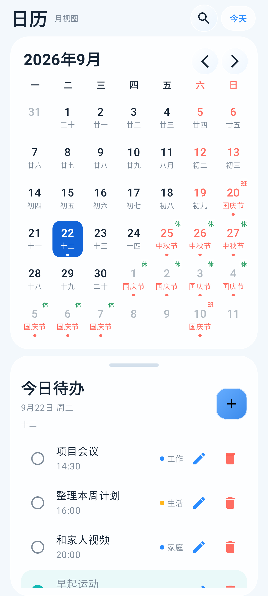
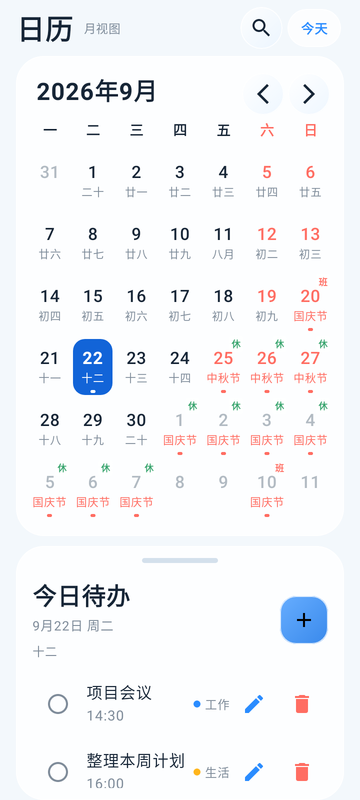
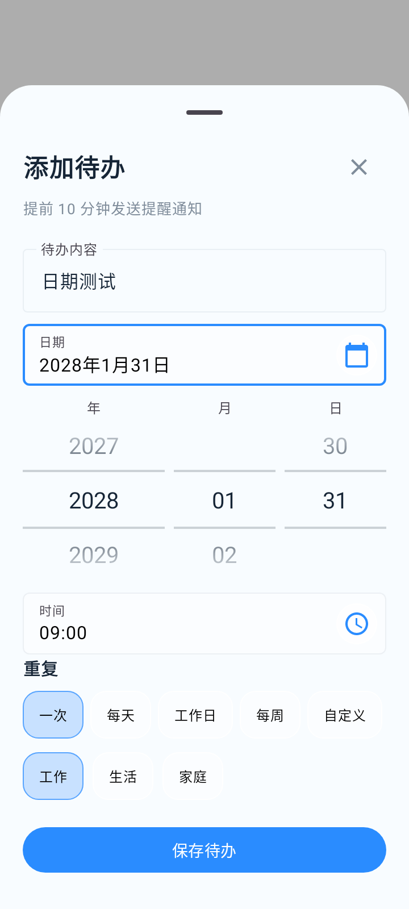
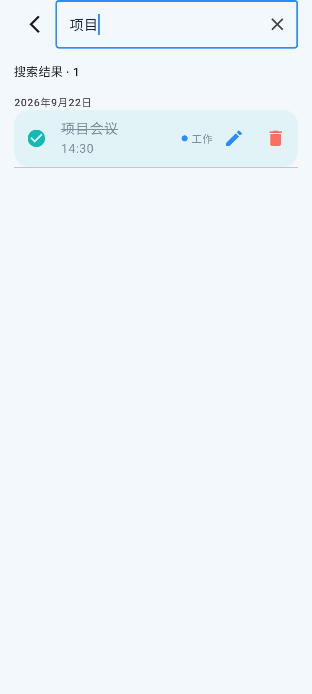

# 流光日历

一个Android 日历原型，使用 Kotlin + Jetpack Compose。界面简单大方，日历+待办组合，让你的工作生活一目了然。

## 当前已实现

- 周一到周日的月视图
- 公历日期、农历示意文本、节假日标签
- 月份前后切换和月份选择
- 当天待办列表
- 待办完成/取消完成
- 点击任务分类区域延期到下一天
- 添加待办底部弹层
- 液态玻璃风格的半透明面板

## 截图

| 主界面 | 添加待办 | 搜索 |
| --- | --- | --- |
|  |  |  |

## 运行

使用 Android Studio 打开当前目录，等待 Gradle 同步后运行 `app`。

## APK

最新调试版 APK：[`liuguang-calendar-v17-debug.apk`](artifacts/liuguang-calendar-v17-debug.apk)

下一阶段可以接入真实农历算法、节假日数据源、Room 持久化和更完整的系统提醒能力。
